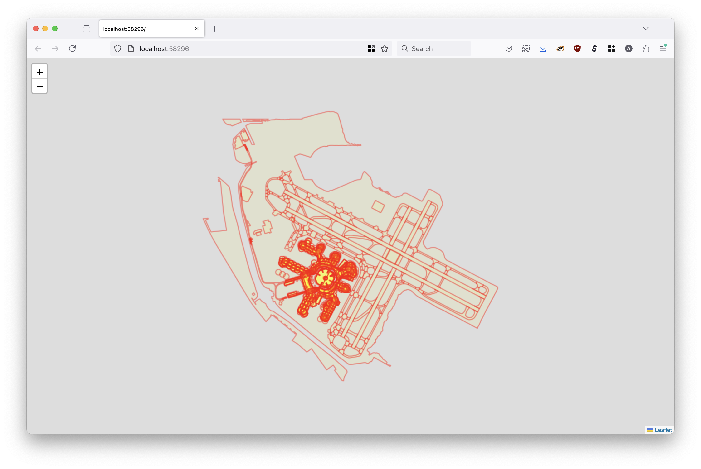
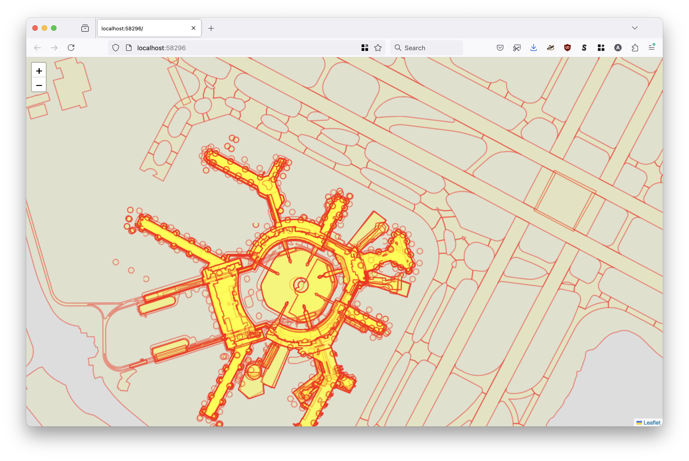
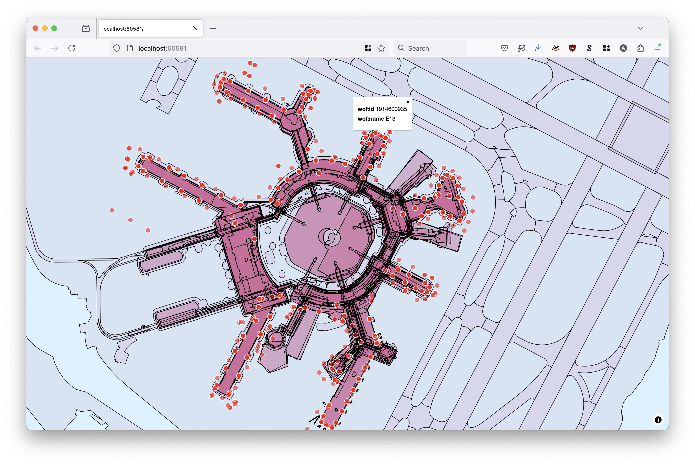
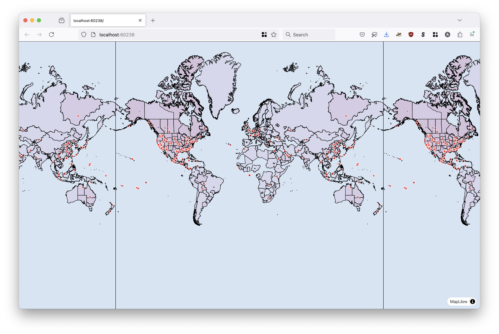
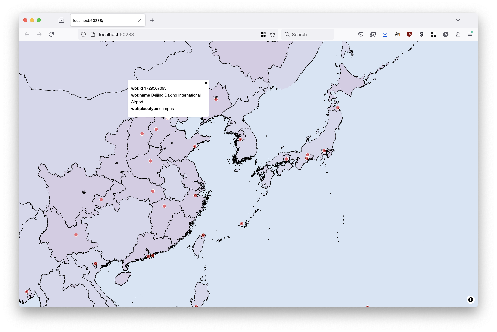
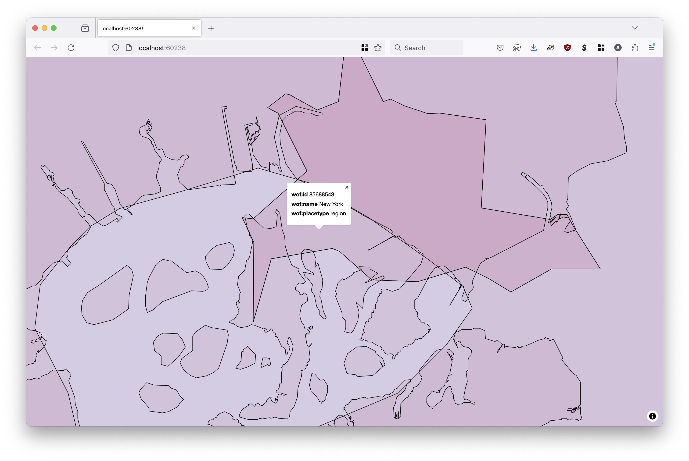

# go-geoparquet-show

Command-line tool for serving GeoParquet data as vector tiles from an on-demand web server.

## Motivation

It's like [go-geojson-show](https://github.com/sfomuseum/go-geojson-show) (which is itself meant to be a simpler and dumber version of [geojson.io](https://geojson.io)) but for GeoParquet files. Specifically, a simple binary application for serving GeoParquet data as vector tiles from an on-demand web server.

Have a look at the [Small focused tools for visualizing geographic data](https://millsfield.sfomuseum.org/blog/2024/10/02/show/) blog post for more background.

## Important

* This is an early-stage project. There may still be bugs (or just bad decisions).

* It works reasonably well for small GeoParquet files. It is _very slow_ for large GeoParquet files. Under the hood it is using [DuckDB](https://www.duckdb.org/), and more specifically the [go-duckdb](https://github.com/marcboeker/go-duckdb) package, to query GeoParquet files. Maybe I am just "doing it wrong"? 

* There are no interactive features for the Leaflet-based renderer yet. The code is using the [Leaflet/Leaflet.VectorGrid](https://github.com/Leaflet/Leaflet.VectorGrid) package to render tiles but all the map `onclick` events trigger "L.DomEvent._fakeStop is not a function" errors which I haven't figured out yet. Any help or pointers would be appreciated. If you want or need interactive popups please use the "maplibre" renderer.

* It is not possible to define custom styles yet. There is a single global style applied to all features.

* It is not possible to define different layers for features. Currently all features are assigned to a layer named "all".

* It is not possible to filter the features returned for any given layer. Currently all the feature contained by a (map) tile's extent are returned.

## Tools

```
$> make cli
go build -mod vendor -ldflags="-s -w" -o bin/show cmd/show/main.go
```

_If you encounter problems building the tools it might have something to do with the way `go-duckdb` is vendored. The best place to start debugging things is [this section in the go-duckdb documentation](https://github.com/marcboeker/go-duckdb?tab=readme-ov-file#vendoring)._

To enable use the [WebViewBrowser `Browser` implementation](https://github.com/sfomuseum/go-www-show?tab=readme-ov-file#webviewbrowser-webview) tools will need to be build with the `webview` tag set. For example:

```
$> go build -mod vendor -ldflags="-s -w" -tags webview -o bin/show cmd/show/main.go
```

### show

```
$> ./bin/show -h
Command-line tool for serving GeoParquet features as vector tiles from an on-demand web server.
Usage:
	 ./bin/show [options]
Valid options are:
  -browser-uri string
    	A valid sfomuseum/go-www-show/v2.Browser URI. Valid options are: web:// (default "web://")
  -data-source string
    	The URI of the GeoParquet data. Specifically, the value passed to the DuckDB read_parquet() function.
  -database-engine string
    	The database/sql engine (driver) to use. (default "duckdb")
  -label value
    	Zero or more (GeoJSON Feature) properties to use to construct a label for a feature's popup menu when it is clicked on.
  -max-x-column string
    	An option column name to use for a initial bounding box constraint. This columns is expected to contain the maximum X (longitude) value of the geometry it is associated with. This will only work if the -max-y-column flag is also set.
  -max-y-column string
    	An option column name to use for a initial bounding box constraint. This columns is expected to contain the maximum Y (latitude) value of the geometry it is associated with. This will only work if the -max-x-column flag is also set.
  -port int
    	The port number to listen for requests on (on localhost). If 0 then a random port number will be chosen.
  -renderer string
    	Which rendering library to use to draw vector tiles. Valid options are: leaflet, maplibre. (default "leaflet")
  -verbose
    	Enable vebose (debug) logging.
```

#### Examples

##### Serve a GeoParquet file derived from all the records in the [sfomuseum-data-architecture](https://github.com/sfomuseum-data/sfomuseum-data-architecture) repository:



```
$> ./bin/show \
	-data-source /usr/local/data/arch.geoparquet \
	-verbose
	
2024/08/20 17:37:53 DEBUG Verbose logging enabled
2024/08/20 17:37:53 DEBUG Start server
2024/08/20 17:37:53 DEBUG HEAD request succeeded url=http://localhost:58296
2024/08/20 17:37:53 INFO Server is ready and features are viewable url=http://localhost:58296
2024/08/20 17:37:54 ERROR Failed to unmarshal geometry layer=all geom="GEOMETRYCOLLECTION (MULTIPOLYGON (((-122.388006 37.614539, -122.387968 37.614548, -122.387967 37.614547, -122.388005 37.614538, -122.388006 37.614539)), ((-122.387948 37.614553, -122.387913 37.614561, -122.387913 37.614561, -122.387948 37.614552, -122.387948 37.614553)), ((-122.387997 37.614517, -122.387961 37.614526, -122.387961 37.614527, -122.387997 37.614518, -122.387997 37.614517)), ((-122.387938 37.614532, -122.387904 37.61454, -122.387905 37.614541, -122.387938 37.614532, -122.387938 37.614532))), MULTIPOLYGON (((-122.387993 37.614604, -122.388082 37.614582, -122.388082 37.614581, -122.387993 37.614603, -122.387993 37.614604)), ((-122.388029 37.614445, -122.387951 37.614464, -122.387951 37.614465, -122.388029 37.614446, -122.388029 37.614445)), ((-122.387924 37.614534, -122.387904 37.614539, -122.387905 37.61454, -122.387925 37.614535, -122.387924 37.614534))))" error="wkt: unsupported geometry"
2024/08/20 17:37:54 DEBUG Time to get features layer=all count=609 time=390.414167ms
2024/08/20 17:37:55 DEBUG Time to get features layer=all count=1 time=947.971541ms
2024/08/20 17:37:55 DEBUG Time to get features layer=all count=196 time=1.141258459s
2024/08/20 17:37:55 DEBUG Time to get features layer=all count=298 time=1.142821084s
2024/08/20 17:37:55 DEBUG Time to get features layer=all count=9 time=1.233271s
2024/08/20 17:37:55 DEBUG Time to get features layer=all count=803 time=1.281584375s
... and so on
```

The map view is initialized to fit the extent of all the features in the GeoParquet database. Here's another screenshot zoomed in to a smaller section:



For reasons I don't really understand yet the [Leaflet/Leaflet.VectorGrid](https://github.com/Leaflet/Leaflet.VectorGrid) package which is used to render vector tiles throws errors for `onclick` events in the map so those interactions are currently disabled.

##### Serve a GeoParquet file derived from all the records in the [sfomuseum-data-architecture](https://github.com/sfomuseum-data/sfomuseum-data-architecture) repository using the [MapLibre-GL](https://maplibre.org/maplibre-gl-js) renderer:



```
$> ./bin/show \
	-data-source /usr/local/data/arch.geoparquet \
	-label wof:id \
	-label wof:name \
	-renderer maplibre
	
2024/08/21 13:40:52 INFO Server is ready and features are viewable url=http://localhost:60581
```

This is the same as the previous example except that the code is using [MapLibre-GL](https://maplibre.org/maplibre-gl-js) renderer to draw feature and enable popup menus when individual features are clicked on.

##### Serve a GeoParquet file derived from all the records in the [sfomuseum-data-whosonfirst](https://github.com/sfomuseum-data/sfomuseum-data-whosonfirst) repository using the [MapLibre-GL](https://maplibre.org/maplibre-gl-js) renderer:



```
$> ./bin/show \
	-data-source /usr/local/data/wof.geoparquet \
	-label wof:id \
	-label wof:name \
	-label wof:placetype
	-renderer maplibre \
	-verbose	
2024/08/21 13:29:16 DEBUG Verbose logging enabled
2024/08/21 13:29:16 DEBUG Start server
2024/08/21 13:29:17 DEBUG HEAD request succeeded url=http://localhost:60238
2024/08/21 13:29:17 INFO Server is ready and features are viewable url=http://localhost:60238
```

The [sfomuseum-data-whosonfirst](https://github.com/sfomuseum-data/sfomuseum-data-whosonfirst) repository is a clone of [Who's On First](https://whosonfirst.org) (WOF) records specific to [SFO Museum](https://collection.sfomuseum.org) so many places (localities, regions even some countries) are not represented in these data.



There are still some interaction bugs around click events and popup menus. For example the WOF record for [JFK airport](https://spelunker.whosonfirst.org/id/102534365), with its distinctively wonky geometry derived from the [Flickr Alpha Shapes](https://code.flickr.net/2008/10/30/the-shape-of-alpha/), is clearly present in the data but it is not possible to select it.



## Help wanted

Here's a short list of things which are on the "to do" list that I'd love help or suggestions with. As of this writing they are all JavaScript issues related to the code in [static/www/javascript/show.js](static/www/javascript/show.js).

### Leaflet.VectorGrid

* Why do `map.onclick` events trigger "L.DomEvent._fakeStop is not a function" errors?

### MapLibre GL JS

* What is the necessary (MapLibre GL style) syntax to change a feature's colour when it is clicked on?

* What is the necessary (MapLibre GL style) syntax to scale Point (and MultiPoint) layers based on zoom level? There's code to do this now but I'm not convinced it's doing anything. I may have missed something in the docs.

* What is the best way to account for `onclick` events for multiple, overlapping features?

### Misc

* Is there a simple-and-dumb JavaScript function for dumping a feature's properties to a responsive HTML table in a popup menu? (No frameworks or build tools allowed.)

## See also

* https://geoparquet.org/
* https://www.duckdb.org/
* https://github.com/marcboeker/go-duckdb
* https://github.com/Leaflet/Leaflet.VectorGrid
* https://maplibre.org/maplibre-gl-js/docs/
* https://github.com/sfomuseum/go-http-mvt
* https://github.com/sfomuseum/go-www-show
